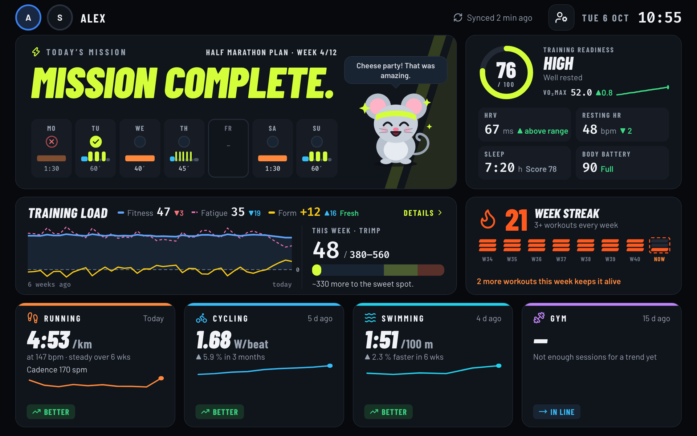
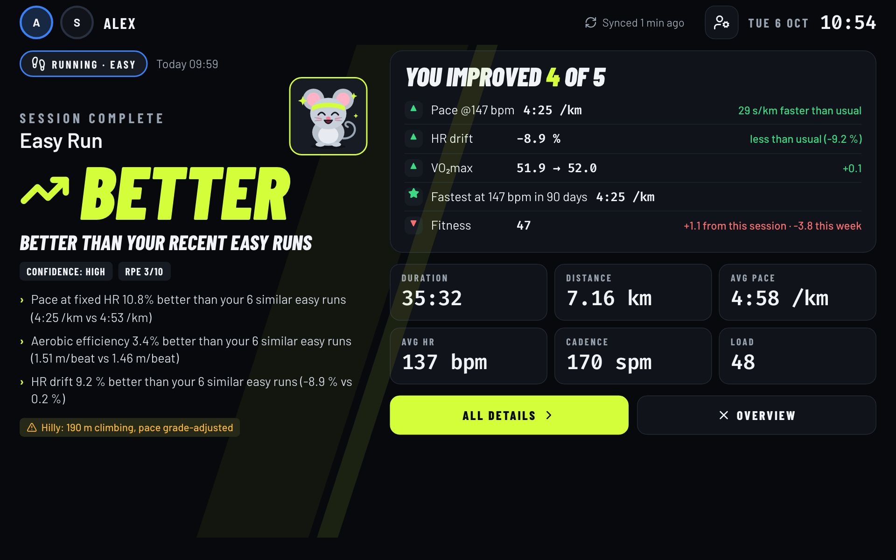
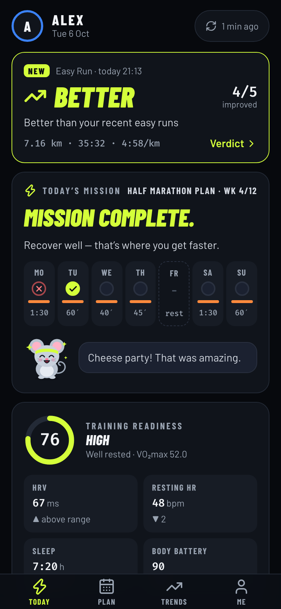
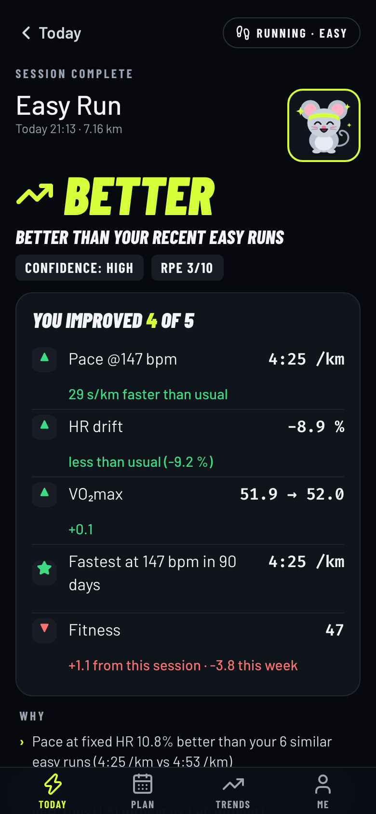
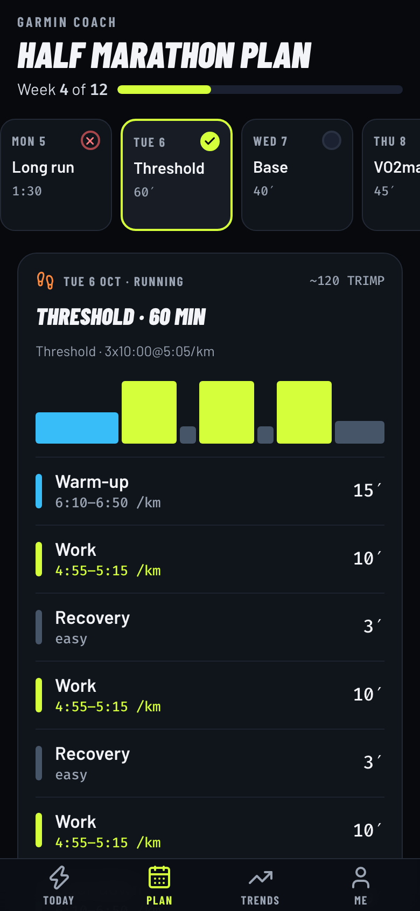
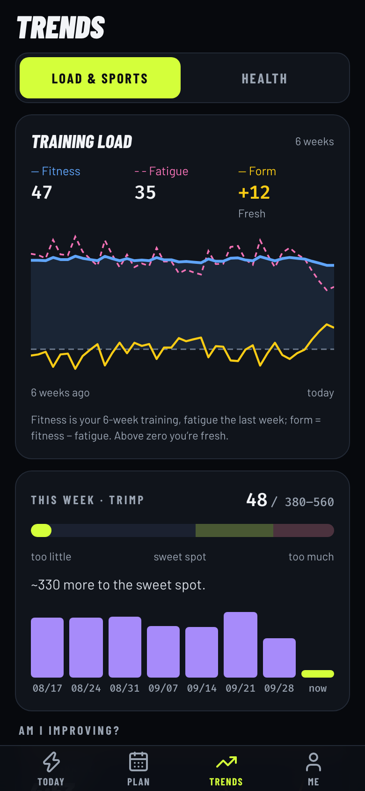
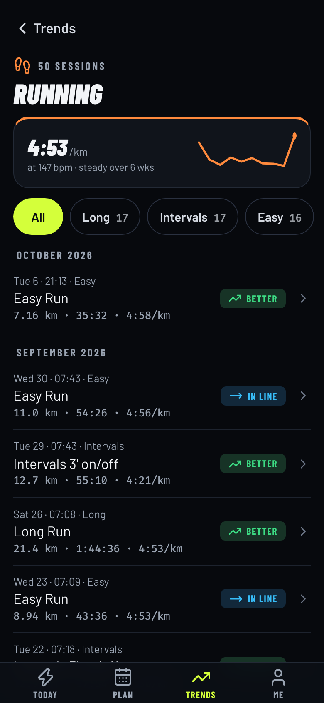

# Fitvio

**Your Garmin data on the wall — and one honest answer after every workout: *did this session make me better?***

[](https://github.com/romanbrej/fitvio/actions/workflows/build.yml)
[](LICENSE)


**[▶ Try the demo](https://romanbrej.github.io/fitvio/)**: the wall and the phone app in your browser, with made-up data for two athletes. Nothing to install, nothing is sent anywhere.

A self-hosted dashboard for a tablet on your wall. It pulls your activities and health data from Garmin Connect, compares every new workout with your own similar sessions, and shows today's plan, your recovery and how each sport is trending — with a little training buddy that reacts to how you're doing.

I built it for my own hallway: a Raspberry Pi in the cupboard and a Samsung Galaxy Tab A8 on the wall. It's free, open source and runs entirely on your own network — no cloud, no account with me, no tracking.





<sub>Screenshots use the built-in demo data.</sub>

## On your phone

Open the same address on your phone (home Wi-Fi) and Fitvio becomes your personal training companion: pick yourself once, then four tabs — **Today, Plan, Trends, Me**. A fresh workout shows up as a verdict card on top of Today instead of taking over the screen, and nothing you do on the phone changes what the wall shows. Tap a sport for its whole history, month by month, filtered by type (easy, long, intervals …).

<p>
  
  
  
  
  
</p>

## Quick start

You need a machine in your home network with **Docker** (amd64 or arm64) and a **Garmin Connect** account.

```bash
mkdir fitvio && cd fitvio
curl -fsSLO https://raw.githubusercontent.com/romanbrej/fitvio/main/docker-compose.yml
mkdir -p data config && printf 'FITVIO_UID=%s\nFITVIO_GID=%s\nTZ=Europe/Berlin\n' "$(id -u)" "$(id -g)" > .env
docker compose up -d
```

Open **`http://<server-ip>:8765`**, sign in with your Garmin account, and watch your history arrive. That's it — the wall keeps itself in sync from now on. Put it on a tablet in kiosk mode ([how](docs/setup.md#put-it-on-the-wall)).

**Just want to look around?** One command, no Garmin account, made-up data:

```bash
docker run --rm -p 8765:8765 -e FITVIO_CONFIG=/tmp/demo/users.json -e FITVIO_DB=/tmp/demo/app.db \
  ghcr.io/romanbrej/fitvio sh -c 'mkdir -p /tmp/demo && cp config/users.example.json /tmp/demo/users.json && fitvio demo && fitvio serve --host 0.0.0.0'
```

…then open `http://localhost:8765`.

## What you get

- **A verdict after every workout** — *Better / In line / Worse* than your similar sessions from the last weeks, with the reasons in plain words: pace per heartbeat (grade- and heat-adjusted), HR drift, power, SWOLF, estimated 1-rep max.
- **Weather that counts** — hourly temperature, dew point, humidity and wind for every outdoor run and ride from [Open-Meteo](https://open-meteo.com), along your rough route and for every hour of the session. Heat and humidity are corrected out of the verdict, and Fitvio learns from your own sessions how much heat costs *you*, per sport. A hot day no longer looks like a bad day.
- **Today's mission** — one headline from Garmin's Training Readiness, and the week of your **Garmin Coach plan**: done ✓, missed ×, today, planned. Tap any day for its workout, step by step.
- **Training load that makes sense** — fitness, fatigue and form on one chart, plus a weekly *sweet spot* that keeps you improving without overdoing it.
- **Recovery at a glance** — readiness, HRV against your normal range, resting HR, sleep, Body Battery, VO₂max.
- **Every sport, one trend** — running, cycling, swimming and gym, each with the number that matters and its 6-week trend.
- **A training buddy** — pick one of 8 animals; it cheers after a good session, gets hungry when you skip, sleeps at night.
- **Made for the wall** — big type, day and night screens, the newest activity takes over the screen, auto-scales to big tablets.
- **For the whole household** — one Garmin login per person; tap an avatar to switch.
- **On your phone too** — a personal app with Today, Plan, Trends and Me, plus every workout you ever did per sport (home Wi-Fi only).
- **Private by design** — runs on your server, LAN only; your Garmin login and health data never leave your home. The weather lookup only sends a rough position (rounded to about 11 km) and the date.

## How it works

```
Garmin watch → Garmin Connect → GarminDB (on your server) → fitvio: ingest, analyse, verdicts → wall (any browser)
```

New activities show up on the wall about 2–3 minutes after your watch syncs: the app checks Garmin for a new activity every 2 minutes and runs a quick differential sync; health data syncs hourly. More in [How it works](docs/how-it-works.md).

## FAQ

**Which watches work?** Any Garmin that syncs to Garmin Connect. Sport-specific numbers depend on your watch and sensors (power for cycling, SWOLF for swimming, reps and weight for gym).

**Do I need Garmin Coach?** No. Without a plan in your Garmin calendar the week strip just doesn't show; everything else works.

**Does it work with two-factor login?** Yes — Fitvio asks for the code when you connect.

**What hardware do I need?** Any always-on amd64 or arm64 machine with Docker: a Raspberry Pi, NAS, mini PC or home server. Prefer an SSD over an SD card. For the wall, any tablet with a browser in kiosk mode (I use Fully Kiosk Browser).

**Can I see it outside my home?** No, by design — it's built for your home network only. Don't expose it to the internet.

**Where does my data go?** Nowhere. Your Garmin login and data stay in the `data/` folder on your server. For the weather, Open-Meteo gets a rough position (a point every 30 minutes, rounded to about 11 km) and the dates, never your exact route or anything about you; it can be switched off per person. Details in [Security and privacy](docs/security.md).

## Feedback and contributing

This is a young project and I'd love to hear how it works for you. Found a bug, a watch that behaves differently, or have an idea? [Open an issue](https://github.com/romanbrej/fitvio/issues). Pull requests are welcome — [Development](docs/development.md) gets you running with demo data in a few minutes.

## Documentation

| | |
|---|---|
| [Setup and hosting](docs/setup.md) | Docker, automatic updates, connecting Garmin, without Docker, putting it on the wall |
| [How it works](docs/how-it-works.md) | Verdicts per sport, heat adjustment, the Garmin plan, the buddy, syncing, limitations |
| [Security and privacy](docs/security.md) | What's stored where, how the web app is protected, reporting issues |
| [Development](docs/development.md) | Local setup with demo data, tests, CLI, project layout |

## Credits and disclaimer

Built on [GarminDB](https://github.com/tcgoetz/GarminDB), [garminconnect](https://github.com/cyberjunky/python-garminconnect) and [fitdecode](https://github.com/polyvertex/fitdecode).

Built with the help of [Claude Code](https://claude.com/claude-code) (an AI coding assistant); designed, reviewed and tested by me.

Fitvio is not affiliated with or endorsed by Garmin. It uses the unofficial Garmin Connect login (through GarminDB and garminconnect), which Garmin can change at any time. It is not a medical device — its verdicts are training feedback, not health advice.

Licensed under the [GNU General Public License v2.0](LICENSE).
